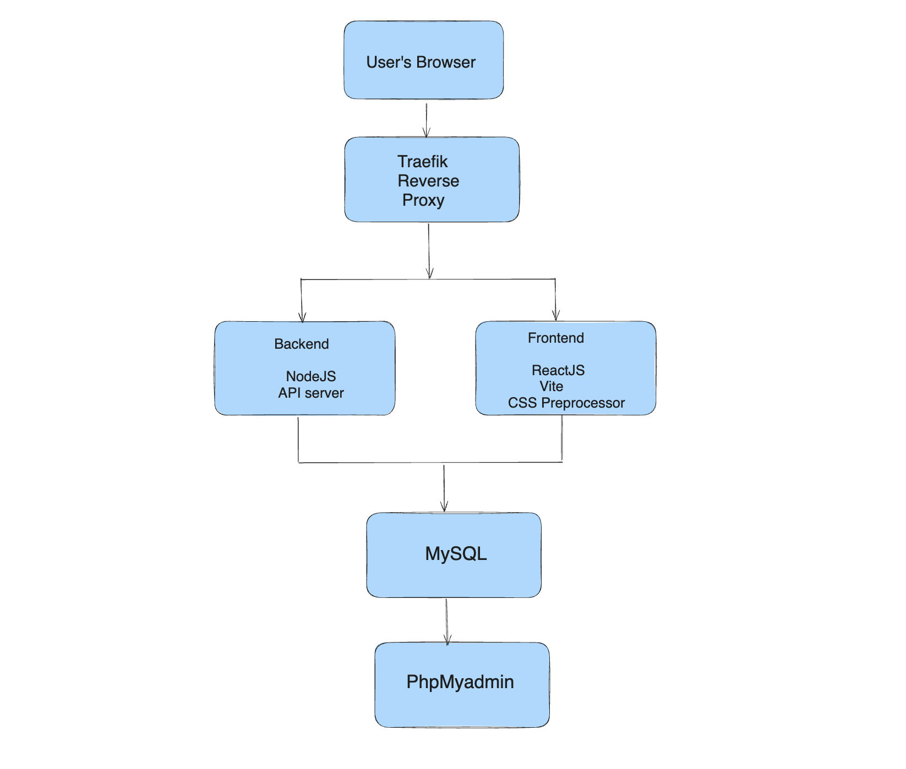

# Todo App

This is a full-stack todo application used as a Docker challenge. Your job is to containerize it.

**Read this file first to understand the app, then open `CHALLENGE.md` to get started.**

---

## Application Architecture



The app has two parts:

- **Frontend** — a React app built with [Vite](https://vitejs.dev/)
- **Backend** — a Node.js/Express API

When packaged for production, the frontend is compiled into static HTML, CSS, and JS and bundled with the backend, which serves it as static assets. There is no server-side rendering.

During development, the frontend and backend run as separate services because they need different dev tools — Vite for the React app and [nodemon](https://nodemon.io/) for the backend.

---

## Project Structure

```
├── client/         # React frontend (Vite)
├── backend/        # Node.js/Express API
│   └── src/
│       └── persistence/   # Database layer (supports SQLite and MySQL)
├── .npmrc          # npm configuration
```

---

## The Challenge

See [`CHALLENGE.md`](./CHALLENGE.md) for the full challenge instructions and learning objectives.
